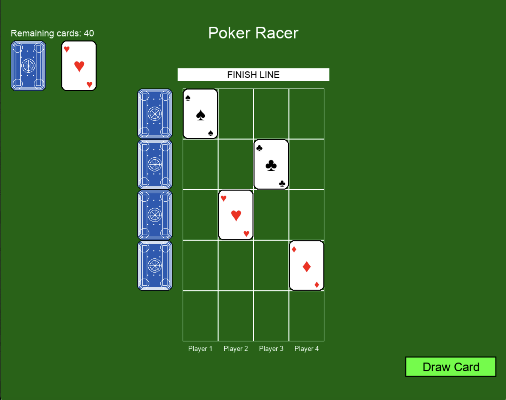

# Poker Racer

## Game Overview
Poker Racer is an exciting card-based racing game where players compete to reach the finish line first. Each player selects a card suit and races their card up the board, with movements determined by the cards drawn from the deck.

I got the idea from a instagram reels video of group of people playing this game. I thought it would be a fun game to make.

## Game Rules

### Setup
1. **Player Selection**: 2-4 players can participate. Each player selects one of the four card suits (Clubs ♣, Hearts ♥, Spades ♠, or Diamonds ♦) as their racing piece.

2. **Board Setup**: The game board consists of a grid with:
   - A starting line at the bottom
   - A finish line at the top
   - Hidden cards along the left side 
   - Player pieces at the starting positions

### Gameplay

#### Basic Movement
1. Players take turns drawing cards from the deck. 
2. When a card is drawn, all players whose suit matches the drawn card move forward one space.
3. If no player's suit matches the drawn card, no movement occurs that turn.

#### Special Rules
1. **Same Row Rule**: When all players land on the same row (and not at the starting position), the hidden card for that row is revealed.
   - Any player whose suit matches the revealed row card must move backward one space.
   - This creates strategic elements as players try to avoid or force these situations.

2. **Joker Card**: When a Joker card is drawn, all player positions are mirrored:
   - The player furthest ahead will move to the back
   - The player furthest behind will move to the front
   - All other players' positions are adjusted accordingly
   - This dramatic reversal can completely change the game!

### Winning the Game
The first player to cross the finish line (move beyond the top row of the grid) wins the game!

## Strategy Tips
- Be prepared for Joker cards that can completely reverse the race order
- In games with fewer than 4 players, remember that suits not chosen by players will still appear in the deck

## Controls
- Click the "Draw Card" button to draw a card and advance the game
- Watch as your card moves automatically based on the drawn card
- At game end, click "Play Again" to start a new race

## Installation
1. Ensure you have Python and Pygame installed
2. Run `python poker_racing_game.py` to start the game
3. Follow the on-screen instructions to select the number of players and suits

Enjoy the race and may the best suit win!
